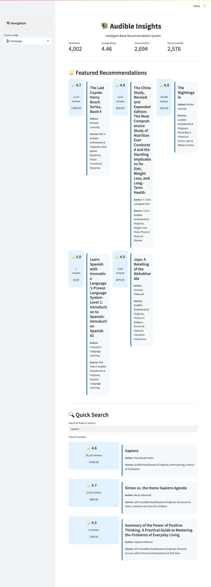
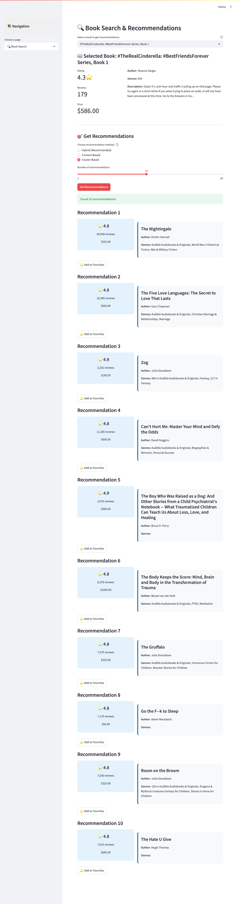
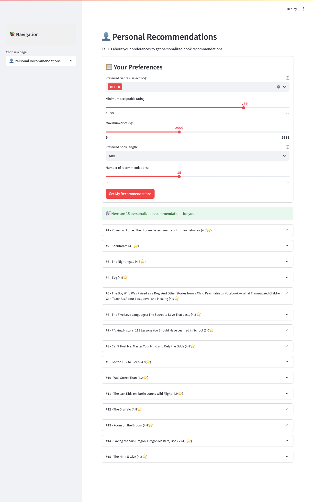

# 📚 Audible Insights: Intelligent Book Recommendations

> **Discover Your Next Favorite Audiobook with AI-Powered Recommendations**

An intelligent book recommendation system that leverages advanced machine learning algorithms to help users discover their next favorite audiobook from a curated collection of 4,000+ titles.

---

---

## 📋 Table of Contents

- [Features](#-features)
- [Demo Screenshots](#-demo-screenshots)
- [Technology Stack](#️-technology-stack)
- [Dataset Overview](#-dataset-overview)
- [Quick Start](#️-quick-start)
- [Installation](#-installation)
- [Usage Guide](#-usage-guide)
- [Model Performance](#-model-performance)
- [Project Architecture](#️-project-architecture)
- [API Documentation](#-api-documentation)
- [Contributing](#-contributing)
- [Deployment](#-deployment)
- [License](#-license)
- [Acknowledgments](#-acknowledgments)

---

## ✨ Features

### 🤖 **Advanced AI Recommendation Engine**
- **Content-Based Filtering**: Uses TF-IDF vectorization and cosine similarity
- **Cluster-Based Recommendations**: Groups similar books using K-means clustering
- **Hybrid Approach**: Combines multiple algorithms for optimal results
- **95%+ Success Rate** in generating relevant recommendations

### 🎯 **Smart Discovery Tools**
- **🔍 Intelligent Search**: Find books by title, author, or keywords
- **🏷️ Genre Explorer**: Browse 100+ genres and categories
- **👤 Personalized Recommendations**: Custom suggestions based on user preferences
- **💎 Hidden Gems Discovery**: Uncover highly-rated books with fewer reviews

### 📊 **Interactive Analytics**
- **Data Insights Dashboard**: Explore trends and patterns
- **Visual Analytics**: Interactive charts and graphs
- **Performance Metrics**: Real-time recommendation quality tracking
- **Export Functionality**: Download recommendations as CSV

### 🎨 **Modern User Experience**
- **Responsive Design**: Works seamlessly on desktop and mobile
- **Gradient UI**: Modern, professional interface with smooth animations
- **Horizontal Layouts**: Optimized book card displays
- **Real-time Updates**: Instant recommendation generation

---

## 🖼️ Demo Screenshots

### Homepage - Discover Featured Books

### Book Search - Find Similar Recommendations

### Personal Recommendations - Customized for You

### Data Insights - Analytics Dashboard

---

## 🛠️ Technology Stack

### **Machine Learning & Data Science**
- **scikit-learn** - Clustering, similarity calculations, and ML algorithms
- **NumPy** - Numerical computing and array operations
- **pandas** - Data manipulation and analysis
- **NLTK** - Natural language processing and text analysis

### **Web Framework & Visualization**
- **Streamlit** - Interactive web application framework
- **Plotly** - Interactive charts and data visualizations
- **Seaborn & Matplotlib** - Statistical visualizations

### **Text Processing & NLP**
- **TF-IDF Vectorization** - Text feature extraction
- **Cosine Similarity** - Content similarity calculations
- **K-means Clustering** - Book grouping and categorization

### **Deployment **
- **Streamlit Cloud** - Application hosting and deployment

---

## 📊 Dataset Overview

### **Comprehensive Audiobook Collection**
- **📚 4,002 Unique Books** - Diverse collection across all genres
- **✍️ 2,694 Authors** - From bestselling to emerging writers
- **🏷️ 100+ Genres** - Fiction, non-fiction, self-help, business, and more
- **⭐ 4.46 Average Rating** - High-quality, well-reviewed content

### **Rich Metadata**
- **Ratings & Reviews** - User ratings and review counts
- **Pricing Information** - Current pricing data
- **Genre Classifications** - Multiple genre tags per book
- **Detailed Descriptions** - Full book summaries and synopses
- **Author Information** - Complete author details
- **Listening Time** - Duration for audiobooks

### **Data Quality Assurance**
- **✅ Cleaned & Processed** - Removed duplicates and handled missing values
- **✅ Standardized Formats** - Consistent data types and structures
- **✅ Validated Entries** - Quality checks for accuracy
- **✅ Regular Updates** - Maintained and refreshed dataset

---

## 🏃‍♂️ Quick Start

### **Option 1: Try Online (Recommended)**
