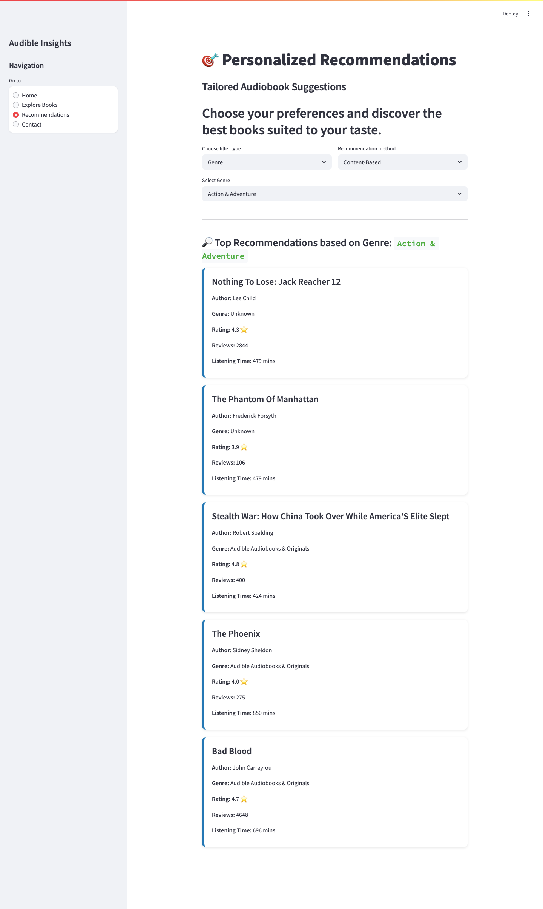

# 🎧 Audible Insights: Intelligent Audiobook Recommendation System

Welcome to **Audible Insights**, a smart audiobook recommendation system designed to enhance the audiobook discovery experience using data analysis, clustering, and collaborative filtering.

---

## 📌 Project Overview

This project combines **Exploratory Data Analysis (EDA)**, **Content-Based Filtering**, **Clustering**, and **Collaborative Filtering** (using Surprise's SVD algorithm) to create an intelligent recommendation system based on Audible audiobook data.

---

## 📂 Dataset

The data is sourced from Audible and includes key features:
- `Book Name`
- `Author`
- `Rating` & `Number of Reviews`
- `Price`
- `Genre`
- `Listening Time (minutes)`
- `Description` (cleaned)
- Cluster labels for similar books

Datasets used:
- `Audible_Catlog.csv`
- `Audible_Catlog_Advanced_Features.csv`
- `cleaned_book_data.csv`
- `cleaned_book_data_with_clusters.csv`

---

## ⚙️ Features

- 🔍 **EDA Dashboards**: Visual insights using heatmaps, bar charts, line plots
- 🧠 **Content-Based Recommendations**: Using TF-IDF similarity
- 🧩 **Clustering-Based Recommendations**: With KMeans
- 🤝 **Collaborative Filtering**: SVD model from Surprise library
- 🎯 **Hybrid Recommender**: Combining clustering + collaborative filtering
- 🌐 **Interactive Web App**: Built with Streamlit (`app.py`)

---

## 🧪 Notebooks

- `cleaning.ipynb`: Data preprocessing and cleaning
- `eda.ipynb`: EDA and visual analysis
- `Audible_Recommendation_System.ipynb`: Model development and evaluation

---

## 🛠️ Technologies Used

- **Python**
- **Pandas**, **NumPy**, **Matplotlib**, **Seaborn**
- **Scikit-learn**, **Surprise**, **NLP (TF-IDF)**
- **Streamlit** for web app
- **Jupyter Notebook**

---

## 🚀 How to Run

 Clone the repo:
   ``` bash
   git clone https://github.com/priyanka7411/audible-insights-recommender.git
   cd audible-insights-recommender
```


## 📦Install Dependencies
To install the required Python libraries, run the following command in your terminal:

```bash
pip install -r requirements.txt
```

## 🚀 Run the Streamlit App
To launch the web application, use the following command in your terminal:

```bash
streamlit run app.py
```

## 📸 App Preview




📑 [Download the Audible Insights Presentation (Keynote)](Audible_Insights_Presentation_With_Images.key)


## 📄 License
This project is licensed under the MIT License.

## 🙋‍♀️ Author
**Priyanka Malavade**  
📧 [LinkedIn](https://www.linkedin.com/in/priyanka-malavade)  
💼 Data Enthusiast | 📊 Passionate about AI + Data

---

⭐ If you found this project useful, feel free to give it a star!
